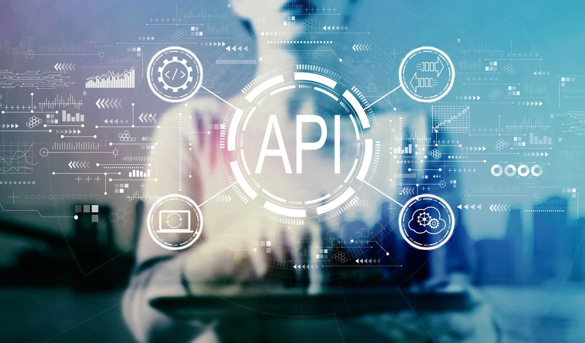

<h1 align= 'center'> SISTEMA DE RECOMENDACION PARA PELICULAS </h1>

## Introducción:
---
El proyecto consiste en crear una API que permita a los usuarios obtener recomendaciones personalizadas de peliculas. La API utiliza un sistema de recomendacion basado en machine learning para proporcionar recomendaciones basadas en los gustos y preferencias de los usuarios. En la interfaz podran consultar datos de peliculas, fechas, participacion de actores, participacion de directores, entre otras.

---

## Contenido:
---
1. [Descripción del problema](#descripción-del-problema)
2. [Datasets](#datasets)
3. [ETL](#etl)
4. [EDA](#eda)
5. [Endpoints](#endpoints)
6. [Links](#links)
7. [Recursos](#recursos)

## Descripción del problema
---

Te acabas de unir a una start-up que agrega plataformas de streaming y tu primer desafío es construir un sistema de recomendación desde cero. Sin embargo, al revisar los datos, te das cuenta de que están en un estado caótico: anidados, sin procesar, y sin ningún tipo de automatización para actualizaciones. En lugar de trabajar directamente en el modelo de machine learning, primero debes asumir el rol de Data Engineer para limpiar y estructurar los datos.

El tiempo es limitado y necesitas entregar un MVP en pocas semanas. Aunque la tarea parece abrumadora, tienes claro el camino a seguir. Sabes que superar este obstáculo es crucial para que el sistema de recomendación cobre vida y se convierta en una pieza clave del negocio.

## Datasets
---

En el apartado de Datasets se listan todos los archivos de datos utilizados en el proyecto. Aquí encontrarás nombre y formato. Esta sección sirve como referencia para los datos disponibles que sustentan el desarrollo del sistema de recomendación.

## ETL
---

En el apartado de ETL se describe el proceso de Extracción, Transformación y Carga (ETL) aplicado a los datos del proyecto. Aquí se detallan las técnicas y herramientas utilizadas para extraer los datos de las fuentes originales, transformarlos en un formato adecuado para el análisis, y cargarlos en el sistema para su uso en el modelo de recomendación. Esta sección proporciona una visión general de cómo se gestionaron los datos a lo largo de su ciclo de vida, asegurando su calidad y adecuación para el análisis.

## EDA
---

En el apartado de EDA se exploran los datos a través de un Análisis Exploratorio de Datos (EDA). Aquí se presentan los hallazgos clave obtenidos durante la exploración inicial, incluyendo estadísticas descriptivas, distribuciones de variables, y cualquier patrón o anomalía detectada. Esta sección ayuda a entender la estructura y características de los datos antes de aplicar técnicas de modelado.

## Endpoints
---

En el apartado de Endpoints se detallan las interfaces de programación (API endpoints) disponibles para interactuar con el sistema. Aquí se incluye una descripción de cada endpoint, los parámetros necesarios, y ejemplos de solicitudes y respuestas. Esta sección es esencial para los desarrolladores que necesiten integrar o consultar el sistema de recomendación desde aplicaciones externas.

## Tecnologías utilizadas

## Instalación

Librerías necesarias: 

fastapi == 0.112.0

uvicorn == 0.30.5

pandas == 2.2.2

scikit-learn == 1.5.1

nltk == 3.8.1

pyarrow == 17.0.0

fastparquet == 2024.5.0

seaborn == 0.13.2

matplotlib == 3.9.2

wordcloud == 1.9.3

Clonar el repositorio: git clone https://github.com/usuario/Proyecto_Recomendacion_peliculas.git

Crear un entorno virtual: ``virtualenv venv``

Activar el entorno virtual: Windows: ``.\venv\Scripts\activate`` macOS/Linux: ``source venv/bin/activate``

Instalar las dependencias: ``pip install -r requirements.txt``

## Links
---
**Modelo de recomendación**

**Video explicativo del proyecto**

## Recursos
---

En el apartado de Recursos se listan todos los materiales y referencias que respaldan el proyecto.

[Datasets originales](https://drive.google.com/drive/folders/15QflnV1gcbI1iVRtJzm5AiI3cg5Rnu8q?usp=sharing)

[Diccionario de los datasets](https://docs.google.com/spreadsheets/d/1k7G3uLoSf2M4ZTqusWFMwY0Pmiz8Sb-V_Y7SMI3vOV8/edit?usp=sharing)

[Readme.md](https://drive.google.com/file/d/1sjmW1aYIhDFia1Rx2SlBvqjn9GFluRtM/view?usp=sharing)

## Autores
[ Andres Acosta](https://github.com/EAndresAcosta)